## Pourquoi faire une V4 ?
**Le serveur n'est actuellement pas optimisé pour la production.** Même si notre but n'a jamais été de devenir Hypixel, on a aujourd'hui besoin d'une meilleur infrastructure pour pouvoir tenir un nombre décent de joueurs.

## Déjà 4 versions ?
**Et oui !** Un petit point pour vous rafraîchir la mémoire:

- La V1 est la version originelle, avec TrigerTae il y a bien longtemps en été 2022 (oui on est vieux)
- La V2 est la reprise mot pour mot du concept, avant les changement de l'EULA
- ... et la V3 est la version qui n’accepte plus les cracks, qui possède un ressource pack et qui s'étend sur plusieurs serveurs

## Es ce que des nouveaux modes de jeux sont prévus ?
Concrètement, **non.** Il y aura bien une modification du bedwars, de nouveaux kits en duels et le oneblock devient un serveur anarchy - mais ce sont des mises à jours prévu depuis un bout de temps déjà

## Es ce que je vais perdre ma progression ?
**Normalement non !** Tout les mondes "statiques" (Survie, Faction & Skyblock) ne changeront pas. Pour les autres modes de jeux, nous essayons de conserver le plus possibles les anciennes basses de données.

## Ancienne infrastructure:

```mermaid
architecture-beta
    group proxy(lucide:antenna)[FRONT VELOCITY]
    group servers(lucide:folder-code)[BACKEND]

    service java(lucide:gamepad-2)[Connections Java] in proxy
    service bedrock(lucide:gamepad-2)[Connections Bedrock] in proxy
    service velocity(lucide:plane)[Velocity] in proxy

    service lobby(lucide:server)[Lobby] in servers
    service bedwars(lucide:server)[Bedwars] in servers
    service uhc(lucide:server)[UHC] in servers
    service arcade(lucide:server)[Arcade] in servers
    service kitpvp(lucide:server)[KitPVP] in servers
    service survie(lucide:server)[Survie] in servers
    service faction(lucide:server)[Faction] in servers
    service skyblock(lucide:server)[Skyblock] in servers
    service oneblock(lucide:server)[Oneblock] in servers

    java:L -- R:velocity
    bedrock:R -- L:velocity
    lobby:T -- B:velocity
    bedwars:T -- B:velocity
    arcade:T -- B:velocity
    uhc:T -- B:velocity
    kitpvp:T -- B:velocity
    survie:T -- B:velocity
    faction:T -- B:velocity
    skyblock:T -- B:velocity
    oneblock:T -- B:velocity
```

### Explications
Comme vous pouvez le voir, l'infrastructure de DEMOCRAFT est actuellement composée de deux groupes. C'est comme ça que fonctionne les proxys par défaut, et c'est donc l'installation de la plupart des serveurs. Mais elle apporte des problèmes:

- Il nous est impossible d'ajouter/supprimer des serveurs pendant que le proxy est en ligne, il faut le recharger ou le redémarrer.
- Les modifications sont manuelles et ne peuvent pas êtres automatisées
---

## Nouvelle Infrastructure:

```mermaid
architecture-beta
    group front(lucide:snowflake)[FRONT SNOWFLAKES]

    service rusty(lucide:database-zap)[Rusty] in front

    service java(lucide:gamepad-2)[Connexions Java] in front
    service bedrock(lucide:gamepad-2)[Connexions Bedrock] in front
    junction junctionCenter
    junction junctionCenter2
    junction junctionCenter3
    service junctionRight(lucide:plane)[Velocity] in front

    group lobby(lucide:folder-code)[GROUPE LOBBY]
    service lobby1(lucide:server)[Lobby 1] in lobby

    group bedwars(lucide:folder-code)[GROUPE BEDWARS]
    service bedwars1(lucide:server)[Bedwars 1] in bedwars

    group duels(lucide:folder-code)[GROUPE DUELS]
    service duels1(lucide:server)[Duels] in duels

    group static(lucide:folder-code)[SERVEURS STATIQUES]
    service static1(lucide:server)[Survie] in static

    group realms(lucide:folder-code)[GROUPE REALMS]
    service realm1(lucide:server)[Realm de Michel] in realms

    group uhc(lucide:folder-code)[GROUPE UHC]
    service uhc1(lucide:server)[UHC 1] in uhc

    group arcade(lucide:folder-code)[GROUPE ARCADE]
    service arcade1(lucide:server)[Arcade 1] in arcade

    junctionCenter:B -- T:junctionCenter2
    junctionCenter2:B -- T:junctionCenter3
    junctionCenter:T -- B:rusty
    rusty:T -- B:junctionRight
    java:R -- L:junctionRight
    bedrock:L -- R:junctionRight

    bedwars1:L -- R:junctionCenter
    arcade1:L -- R:junctionCenter2
    uhc1:L -- R:junctionCenter3

    lobby1:R -- L:junctionCenter
    duels1:R -- L:junctionCenter2
    static1:R -- L:junctionCenter3

    realm1:T -- B:junctionCenter3
```

### Explications
Comparé à notre ancienne infrastructure, les serveurs de backend (où sont stockés les mini-jeux) sont répartis en groupes. Cela nous permet de dynamiquement les modifier, en ajouter ou en supprimer. Plusieurs exemple déjà développés:

- Si il y a une très grande affluence en bedwars, nous pouvons ajouter un serveur pour offrir plus de parties.
- Nous pouvons maintenant diviser tout les modes de jeux KitPVP qui étaient avant sur un seul serveur et les répartir sur plusieurs petit serveurs, qui peuvent êtres booster si besoin. 